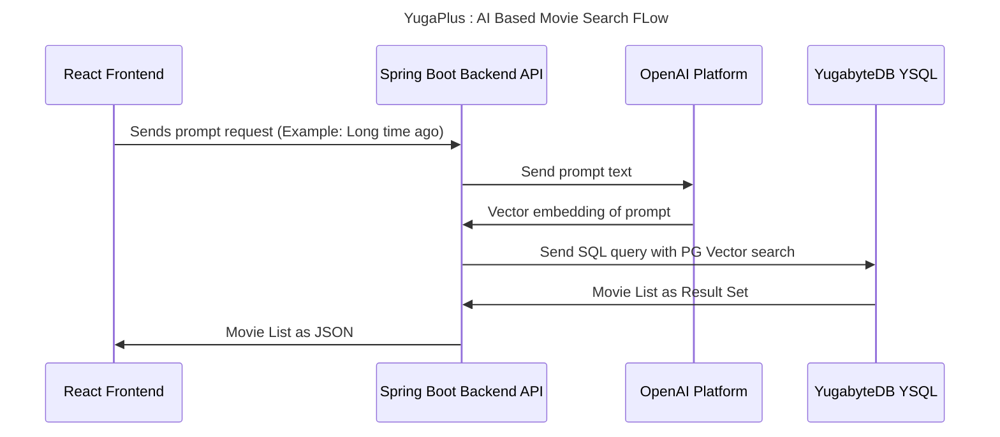
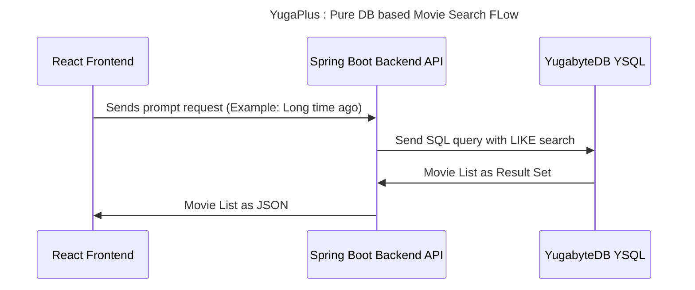

# Local Demo


- App UI: http://localhost:3000
- SQL Pad: http://localhost:3001

# Search Flow


## Code FLow / Sequences



## Code Flow / Sequence - Database Based




## Start app
### Use Postgres

1. Start Postgres on Docker

    ```bash
    docker compose -f $PROJECT_ROOT/deployment/docker/pg.docker-compose.yaml down -v --remove-orphans
    docker compose -f $PROJECT_ROOT/deployment/docker/pg.docker-compose.yaml up -d
    sleep 5
    docker compose -f $PROJECT_ROOT/deployment/docker/pg.docker-compose.yaml exec db-client psql -c 'select version();'
    ```


1. Run Backend application

    ```bash
    cd $PROJECT_ROOT/backend
    mvn clean package -DskipTests
    java -jar target/*.jar
    ```

1. Run Frontend application

    ```bash
    cd $PROJECT_ROOT/frontend
    npm install
    npm start
    ```

### Use YugabyteDB

1. Start YugabyteDB on Docker

    ```bash
    docker compose -f $PROJECT_ROOT/deployment/docker/yb.docker-compose.yaml down -v --remove-orphans
    docker compose -f $PROJECT_ROOT/deployment/docker/yb.docker-compose.yaml up -d
    sleep 5
    docker compose -f $PROJECT_ROOT/deployment/docker/yb.docker-compose.yaml exec db-client ysqlsh -c 'select version();'
    ```


1. Run Backend application

    ```bash
    cd $PROJECT_ROOT/backend
    mvn clean package -DskipTests
    java -jar target/*.jar --spring.profiles.active=yb
    ```

1. Run Frontend application

    ```bash
    cd $PROJECT_ROOT/frontend
    npm install
    npm run
    ```

### Run demo flow

1. Open [web ui][web-ui]
2. Login with credentials (user1@gmail.com/MyYugaPlusPassword)

## Other commands


1. YugabyteDB - Full Stack


    ```bash
    docker compose -f $PROJECT_ROOT/deployment/docker/yb.yaml down -v --remove-orphans
    docker compose -f $PROJECT_ROOT/deployment/docker/yb.yaml up -d
    ```

    ```

1. Postgres - Full Stack


    ```bash
    docker compose -f $PROJECT_ROOT/deployment/docker/pg.yaml down -v --remove-orphans
    docker compose -f $PROJECT_ROOT/deployment/docker/pg.yaml up -d
    ```

1. Load data in YB

    ```bash
    ysqlsh -f $PROJECT_ROOT/backend/src/main/resources/db/migration/V1__enable_pgvector.sql
    ysqlsh -f $PROJECT_ROOT/backend/src/main/resources/db/migration/V1.1__create_movie_table.sql
    ysqlsh -f $PROJECT_ROOT/backend/src/main/resources/db/migration/V1.2__load_movie_dataset_with_embeddings.sql
    ysqlsh -f $PROJECT_ROOT/backend/src/main/resources/db/migration/V1.3__create_user_table.sql
    ysqlsh -f $PROJECT_ROOT/backend/src/main/resources/db/migration/V1.4__create_user_library_table.sql

    # OR with dockerized setup

    docker exec -it docker-db-client-1 ysqlsh -f /project/backend/src/main/resources/db/migration/V1__enable_pgvector.sql
    docker exec -it docker-db-client-1 ysqlsh -f /project/backend/src/main/resources/db/migration/V1.1__create_movie_table.sql
    docker exec -it docker-db-client-1 ysqlsh -f /project/backend/src/main/resources/db/migration/V1.2__load_movie_dataset_with_embeddings.sql
    docker exec -it docker-db-client-1 ysqlsh -f /project/backend/src/main/resources/db/migration/V1.3__create_user_table.sql
    docker exec -it docker-db-client-1 ysqlsh -f /project/backend/src/main/resources/db/migration/V1.4__create_user_library_table.sql

    ```
1. Load data in PG

    ```bash
    psql -f $PROJECT_ROOT/backend/src/main/resources/db/migration/V1__enable_pgvector.sql
    psql -f $PROJECT_ROOT/backend/src/main/resources/db/migration/V1.1__create_movie_table.sql
    psql -f $PROJECT_ROOT/backend/src/main/resources/db/migration/V1.2__load_movie_dataset_with_embeddings.sql
    psql -f $PROJECT_ROOT/backend/src/main/resources/db/migration/V1.3__create_user_table.sql
    psql -f $PROJECT_ROOT/backend/src/main/resources/db/migration/V1.4__create_user_library_table.sql

    # OR with dockerized setup

    docker exec -it docker-db-client-1 psql -f /project/backend/src/main/resources/db/migration/V1__enable_pgvector.sql
    docker exec -it docker-db-client-1 psql -f /project/backend/src/main/resources/db/migration/V1.1__create_movie_table.sql
    docker exec -it docker-db-client-1 psql -f /project/backend/src/main/resources/db/migration/V1.2__load_movie_dataset_with_embeddings.sql
    docker exec -it docker-db-client-1 psql -f /project/backend/src/main/resources/db/migration/V1.3__create_user_table.sql
    docker exec -it docker-db-client-1 psql -f /project/backend/src/main/resources/db/migration/V1.4__create_user_library_table.sql

    ```


[web-ui]: http://localhost:3000
