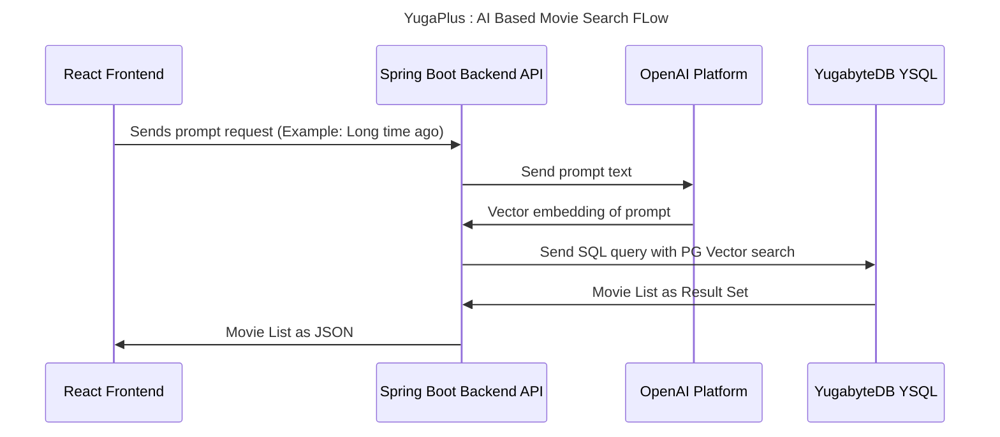
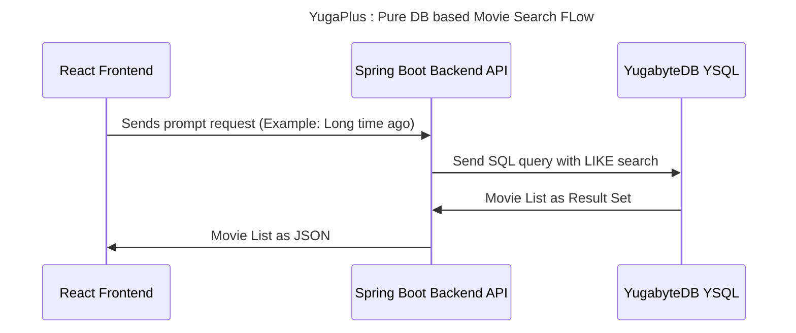
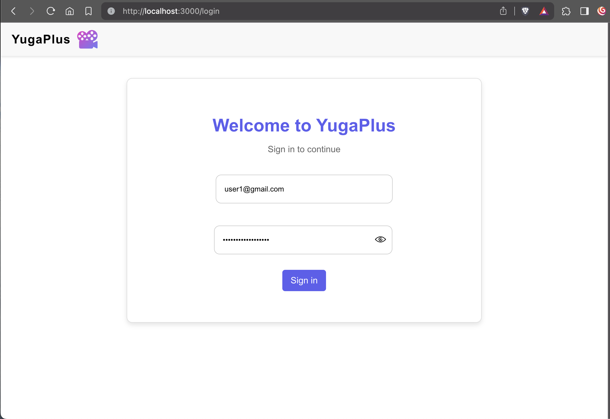
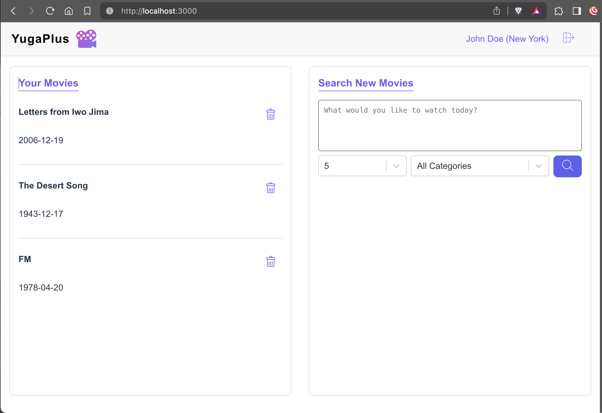
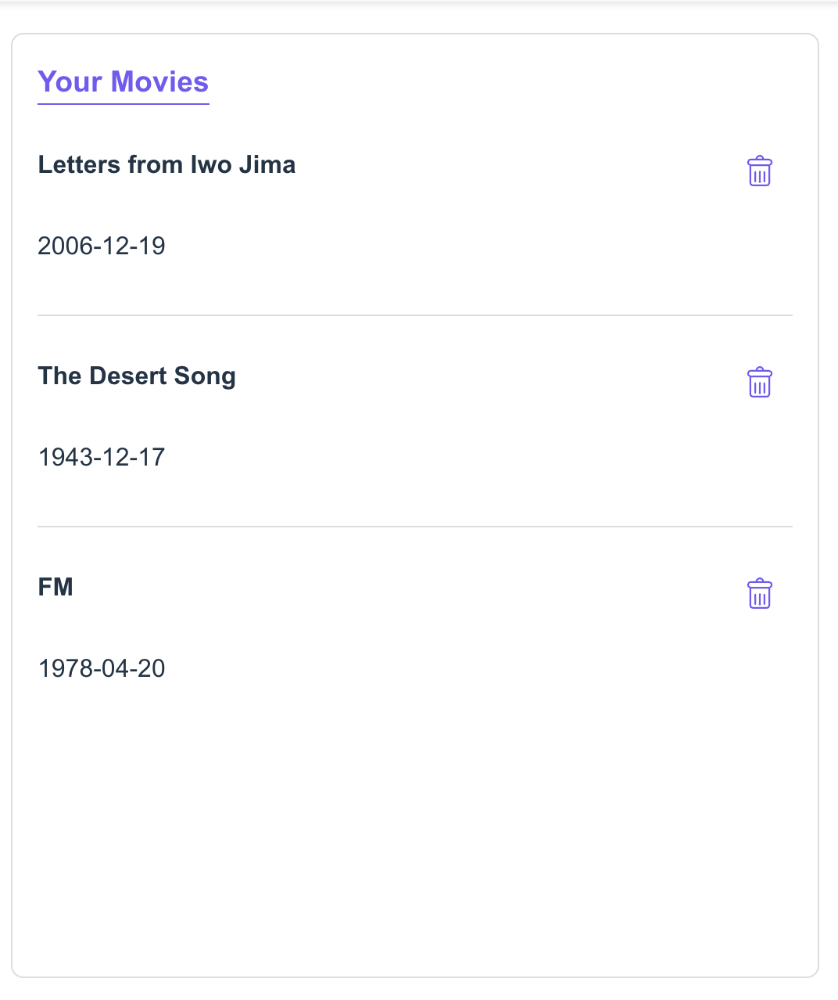
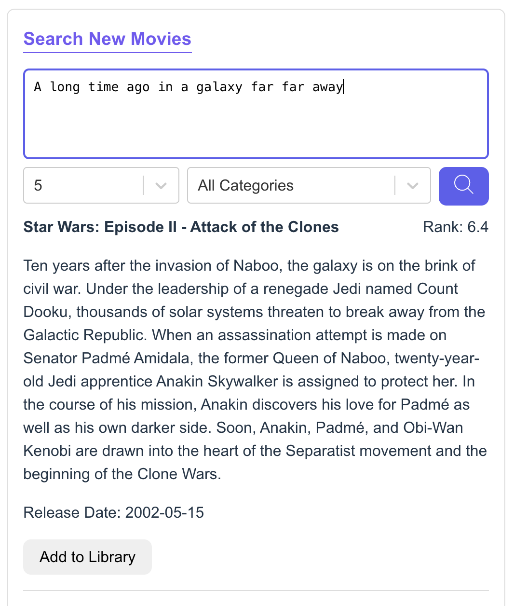

# Local Demo

- App UI: http://localhost:3000
- SQL Pad: http://localhost:3001

# Search Flow

## Code FLow / Sequences



## Code Flow / Sequence - Database Based



## Start app

### Use Postgres

1. Start Postgres on Docker

   ```bash
   docker compose -f $PROJECT_ROOT/deployment/docker/pg.docker-compose.yaml down -v --remove-orphans
   docker compose -f $PROJECT_ROOT/deployment/docker/pg.docker-compose.yaml up -d
   sleep 5
   docker compose -f $PROJECT_ROOT/deployment/docker/pg.docker-compose.yaml exec db-client psql -c 'select version();'
   ```

1. Run Backend application

   ```bash
   cd $PROJECT_ROOT/backend
   mvn clean package -DskipTests
   export BACKEND_API_KEY=superbowl-2024
   java -jar target/*.jar
   ```

1. Run Frontend application

   ```bash
   cd $PROJECT_ROOT/frontend
   npm install
   npm start
   ```

### Use YugabyteDB

1. Start YugabyteDB on Docker

   ```bash
   docker compose -f $PROJECT_ROOT/deployment/docker/yb.docker-compose.yaml down -v --remove-orphans
   docker compose -f $PROJECT_ROOT/deployment/docker/yb.docker-compose.yaml up -d
   sleep 5
   docker compose -f $PROJECT_ROOT/deployment/docker/yb.docker-compose.yaml exec db-client ysqlsh -c 'select version();'
   ```

1. Run Backend application

   ```bash
   cd $PROJECT_ROOT/backend
   mvn clean package -DskipTests
   export BACKEND_API_KEY=superbowl-2024
   java -jar target/*.jar --spring.profiles.active=yb
   ```

1. Run Frontend **application**

   ```bash
   cd $PROJECT_ROOT/frontend
   npm install
   npm run
   ```

### Run local demo flow

1. Start postgres
2. Start app
3. Open [web ui][web-ui]

   

   Login with credentials (user1@gmail.com/MyYugaPlusPassword)

4. Explain UI

   

   1. User Library that comes from `user_library` table and edited with `/api/library/*` APIs

   

   1. Search prompt user Open AI and `movie` table. Search movie `A long time ago in a galaxy far far away`

   

5. Search via api

   ```bash
   http -b GET :8080/api/movie/search prompt=='A long time ago in a galaxy far far away' rank==5 X-Api-Key:$BACKEND_API_KEY
   ```

   Same thing can be done via demo simple script

   ```bash
   deployment/demo search 'Movie about Sports'
   ```

6. Show library in database

   1. On the terminal start sql shell **or** use any SQL tool

      Start a new shell for local db

      ```bash
      docker exec -it docker-db-client-1 psql -h db -c "SELECT u.email, u.user_location, l.added_time, m.id, m.title FROM user_library l INNER JOIN movie m ON l.movie_id = m.id INNER JOIN user_account u ON l.user_id = u.id and u.email = 'user1@gmai.com';"

      #OR

      docker exec -it docker-db-client-1 ysqlsh -h db -c "SELECT u.email, u.user_location, l.added_time, m.id, m.title FROM user_library l INNER JOIN movie m ON l.movie_id = m.id INNER JOIN user_account u ON l.user_id = u.id and u.email = 'user1@gmai.com';"
      ```

      Same thing can be done via simple script

      ```bash
      deployment/demo library user1@gmail.com
      ```

7. Add movie `Star Wars: Episode II - Attack of the Clones`.

   Show updated libray

   ```bash
   deployment/demo library user1@gmail.com
   ```

8. Show API call to alter movie library

   1. Add a movie

      ```bash
      http -b PUT :8080/api/library/add/1891 user==user1@gmail.com X-Api-Key:$BACKEND_API_KEY
      http -b PUT :8080/api/library/add/1895 user==user1@gmail.com X-Api-Key:$BACKEND_API_KEY
      http -b PUT :8080/api/library/add/11 user==user1@gmail.com X-Api-Key:$BACKEND_API_KEY
      ```

   2. Show library

      ```
      deployment/demo library user1@gmail.com
      ```

   3. Delete movie

      ```bash
      http -b DELETE :8080/api/library/remove/11 user==user1@gmail.com X-Api-Key:$BACKEND_API_KEY
      http -b DELETE :8080/api/library/remove/1891 user==user1@gmail.com X-Api-Key:$BACKEND_API_KEY
      http -b DELETE :8080/api/library/remove/1895 user==user1@gmail.com X-Api-Key:$BACKEND_API_KEY
      ```

   4. Show library

      ```
      deployment/demo library user1@gmail.com
      ```

   Simple script to do the same

   ```bash
   deployment/demo update user1@gmail.com
   ```

## Run Cloud Demo

### User Mapping

| email           | full_name        | user_location | update                        |
| --------------- | ---------------- | ------------- | ----------------------------- |
| arisa@gmail.com | Arisa Izuno      | Tokyo         | `demo update arisa@gmail.com` |
| ron4@gmail.com  | Ron Xing         | Kuala Lumpur  | `demo update ron4@gmail.com`  |
| srini@gmail.com | Srinivasa Vasu   | Chennai       | `demo update srini@gmail.com` |
| user1@gmail.com | John Doe         | New York      | `demo update user1@gmail.com` |
| user2@gmail.com | Emely Smith      | Chicago       | `demo update user2@gmail.com` |
| user3@gmail.com | Michael Williams | Los Angeles   | `demo update user3@gmail.com` |
| user4@gmail.com | Jessica Brown    | Boston        | `demo update user4@gmail.com` |
| yogi@gmail.com  | Yogi Rampuria    | Singapore     | `demo update yogi@gmail.com`  |

### Preferred Leader Demo

1. Start application and database on all regions

   ```bash
   # All regions
   demo boot
   demo app-start
   ```

2. Open [Primary Region App UI][cloud-primary-web-ui]
3. Login with credentials (arisa@gmail.com/MyYugaPlusPassword)
4. Quick Show of UI
5. Goto terminal and run search on all region and explain latency

   ```bash
   # All regions
   demo search 'Movie about Sports'
   ```

6. Run update on all regions and explain latency

    ```bash
    # New York
    demo update user1@gmail.com

    # Chicago
    demo update user2@gmail.com

    # Los Angeles
    demo update user3@gmail.com

    # Boston
    demo update user4@gmail.com

    ## APJ
    # Tokyo
    demo update arisa@gmail.com
    # Singapore
    demo update yogi@gmail.com
    # Chennai
    demo update srini@gmail.com
    ```

### Follower Read Demo

1. Start application and database on all regions

   ```bash
   # All regions
   demo app-start enable_follower_reads
   ```

2. Run search on all region and explain latency

   ```bash
   # All regions
   demo search 'Movie about Sports'
   ```

3. Run update on all regions and explain latency

    ```bash
    # New York
    demo update user1@gmail.com

    # Chicago
    demo update user2@gmail.com

    # Los Angeles
    demo update user3@gmail.com

    # Boston
    demo update user4@gmail.com

    ## APJ
    # Tokyo
    demo update arisa@gmail.com
    # Singapore
    demo update yogi@gmail.com
    # Chennai
    demo update srini@gmail.com
    ```

### Geo Partition Demo

1. Start application and database on all regions

   ```bash
   # All regions
   demo db-prepare-geopart
   demo app-start enable_follower_reads
   ```

2. Run update on all regions and explain latency

    ```bash
    # New York
    demo update user1@gmail.com

    # Chicago
    demo update user2@gmail.com

    # Los Angeles
    demo update user3@gmail.com

    # Boston
    demo update user4@gmail.com

    ## APJ
    # Tokyo
    demo update arisa@gmail.com
    # Singapore
    demo update yogi@gmail.com
    # Chennai
    demo update srini@gmail.com
    ```

## Other commands

1. YugabyteDB - Full Stack

   ```bash
   docker compose -f $PROJECT_ROOT/deployment/docker/yb.yaml down -v --remove-orphans
   docker compose -f $PROJECT_ROOT/deployment/docker/yb.yaml up -d
   ```

   ```

   ```

1. Postgres - Full Stack

   ```bash
   docker compose -f $PROJECT_ROOT/deployment/docker/pg.yaml down -v --remove-orphans
   docker compose -f $PROJECT_ROOT/deployment/docker/pg.yaml up -d
   ```

1. Load data in YB

   ```bash
   ysqlsh -f $PROJECT_ROOT/backend/src/main/resources/db/migration/V1__enable_pgvector.sql
   ysqlsh -f $PROJECT_ROOT/backend/src/main/resources/db/migration/V1.1__create_movie_table.sql
   ysqlsh -f $PROJECT_ROOT/backend/src/main/resources/db/migration/V1.2__load_movie_dataset_with_embeddings.sql
   ysqlsh -f $PROJECT_ROOT/backend/src/main/resources/db/migration/V1.3__create_user_table.sql
   ysqlsh -f $PROJECT_ROOT/backend/src/main/resources/db/migration/V1.4__create_user_library_table.sql

   # OR with dockerized setup

   docker exec -it docker-db-client-1 ysqlsh -f /project/backend/src/main/resources/db/migration/V1__enable_pgvector.sql
   docker exec -it docker-db-client-1 ysqlsh -f /project/backend/src/main/resources/db/migration/V1.1__create_movie_table.sql
   docker exec -it docker-db-client-1 ysqlsh -f /project/backend/src/main/resources/db/migration/V1.2__load_movie_dataset_with_embeddings.sql
   docker exec -it docker-db-client-1 ysqlsh -f /project/backend/src/main/resources/db/migration/V1.3__create_user_table.sql
   docker exec -it docker-db-client-1 ysqlsh -f /project/backend/src/main/resources/db/migration/V1.4__create_user_library_table.sql

   ```

1. Load data in PG

   ```bash
   psql -f $PROJECT_ROOT/backend/src/main/resources/db/migration/V1__enable_pgvector.sql
   psql -f $PROJECT_ROOT/backend/src/main/resources/db/migration/V1.1__create_movie_table.sql
   psql -f $PROJECT_ROOT/backend/src/main/resources/db/migration/V1.2__load_movie_dataset_with_embeddings.sql
   psql -f $PROJECT_ROOT/backend/src/main/resources/db/migration/V1.3__create_user_table.sql
   psql -f $PROJECT_ROOT/backend/src/main/resources/db/migration/V1.4__create_user_library_table.sql

   # OR with dockerized setup

   docker exec -it docker-db-client-1 psql -f /project/backend/src/main/resources/db/migration/V1__enable_pgvector.sql
   docker exec -it docker-db-client-1 psql -f /project/backend/src/main/resources/db/migration/V1.1__create_movie_table.sql
   docker exec -it docker-db-client-1 psql -f /project/backend/src/main/resources/db/migration/V1.2__load_movie_dataset_with_embeddings.sql
   docker exec -it docker-db-client-1 psql -f /project/backend/src/main/resources/db/migration/V1.3__create_user_table.sql
   docker exec -it docker-db-client-1 psql -f /project/backend/src/main/resources/db/migration/V1.4__create_user_library_table.sql

   ```

## Search Code

```java

var params = new HashMap<String, Object>();
var query = "";
var categoryFilterExpression = StringUtils.isBlank(category)? "": String.format("{ \"name\": \"%1$s}\" }", category);

if (enableAiSearch){
  // In case OpenAI config is setup
  var promptEmbedding = aiClient.embed(prompt);
  var prompt_vector = promptEmbedding.toString();

  query = """
    SELECT
      id, title, overview, vote_average, release_date
    FROM
      movie
    WHERE
      rank >= :rank
      AND
      generes @> :category::jsonb
      AND
      1 - (overview_vector <=> :prompt_vector::vector) >= :similarity_threshold
    ORDER BY
      overview_vector <=> :prompt_vector::vector
    LIMIT
      :max_results";
  """;
  params.put("rank", rank);
  params.put("prompt_vector", prompt_vector);
  params.put("category", categoryFilterExpression);
  params.put("similarity_threshold", SIMILARITY_THRESHOLD);
  params.put("max_results", MAX_RESULTS);

}else{
  // DB based full text search
  query = """
    SELECT
      id, title, overview, vote_average, release_date
    FROM
      movie
    WHERE
      rank >= :rank
      AND
      generes @> :category::jsonb
      AND
      overview LIKE :prompt
    ORDER BY
      title ASC
    LIMIT
      :max_results";
      """;
  params.put("rank", rank);
  params.put("prompt", prompt);
  params.put("category", categoryFilterExpression);
  params.put("similarity_threshold", SIMILARITY_THRESHOLD);
  params.put("max_results", MAX_RESULTS);
}
var movies = jdbcClient.sql(query.toString())
        .params(params)
        .query(Movie.class).list();
var status = new Status(true, HttpServletResponse.SC_OK, formatDatabaseLatency(execTime));
var response =  new MovieResponse(status, movies);
return response;

```

[web-ui]: http://localhost:3000
[cloud-primary-web-ui]: http://asia-northeast1.apjsb.ws.apj.yugabyte.com:3000
